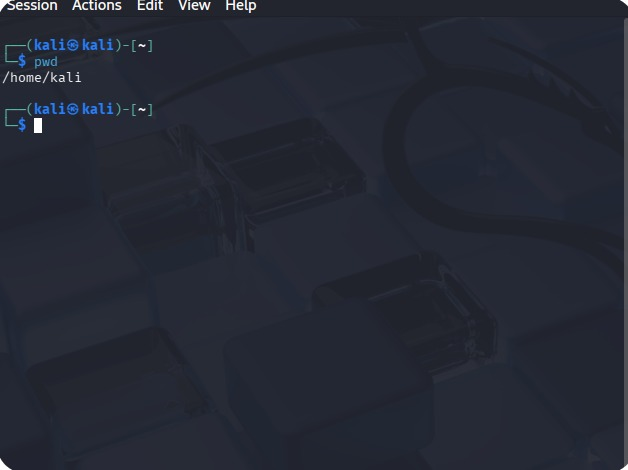
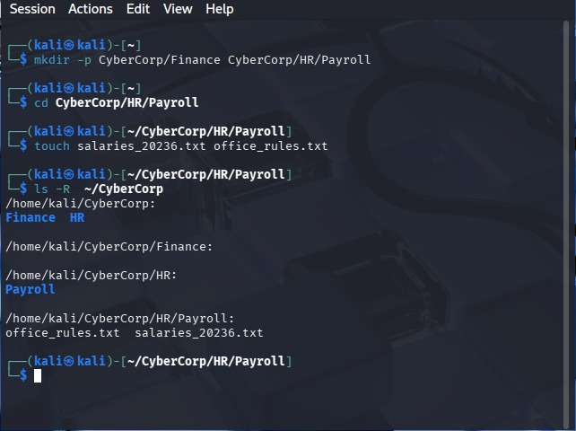
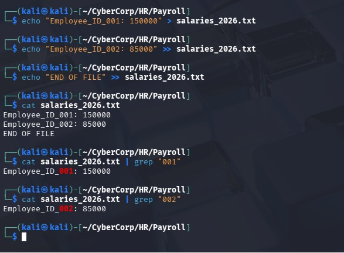
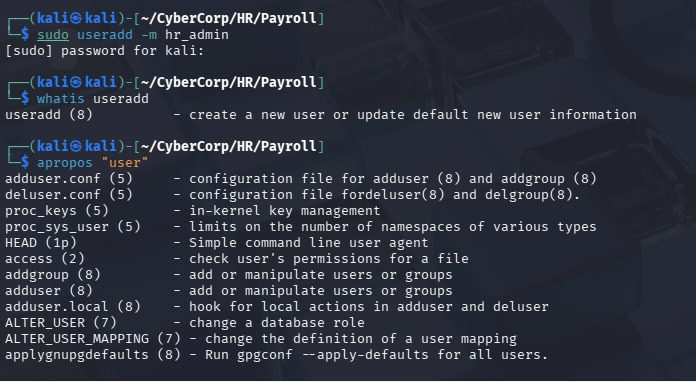
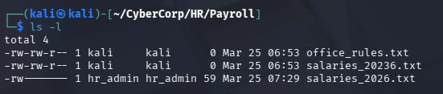
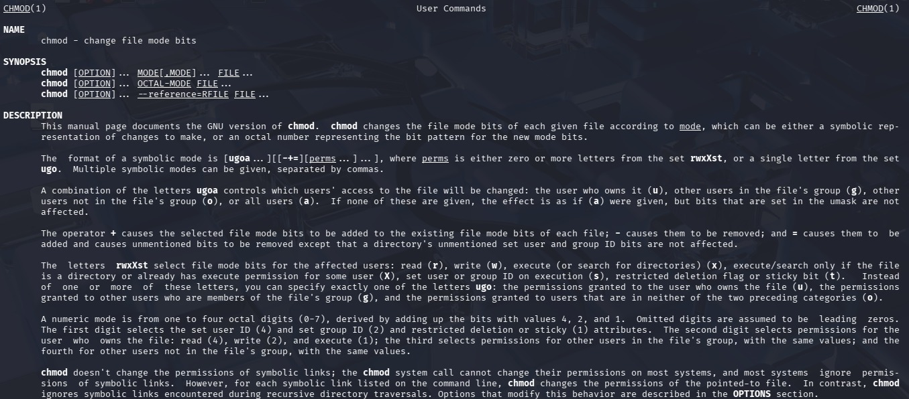
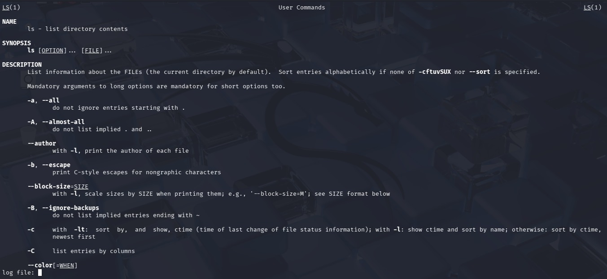

# Linux Identity & Access Management (IAM) Lab: Corporate Data Hardening

## 🛡️ Project Overview
This project demonstrates the transition from a default system state to a **hardened corporate file structure** within a Kali Linux environment. I implemented the **Principle of Least Privilege (PoLP)** by provisioning administrative users, establishing a nested directory architecture, and securing sensitive payroll data using Octal permissions.

## 🛠️ Technical Skills Demonstrated
* **System Architecture:** `mkdir -p`, `pwd`, `ls -R`
* **Data Integrity & Auditing:** Standard Output (`>`), Append (`>>`), Pipes (`|`), `grep`
* **Identity & Access Management (IAM):** `sudo`, `useradd`, `passwd`
* **Security Hardening:** `chown` (Ownership Transfer), `chmod 600` (Restricted Access)
* **Technical Documentation:** `man`, `whatis`, `apropos`

---

## 📂 Project Milestones

### 1. Environment & Architecture
I established a tiered directory structure to simulate a corporate environment (**CyberCorp**), separating Finance and HR departments.
* **Screenshots:** `01_System_Architecture_Init.jpeg`, `02_Corporate_Directory_Tree.jpeg`
* 

### 2. Data Provisioning & Audit Trails
Using I/O redirection, I populated sensitive payroll files. I then demonstrated "Log Auditing" by using `grep` to filter specific employee IDs without opening the entire file.
* **Key Command:** `cat salaries_2026.txt | grep "001"`
* **Screenshot:** `03_Data_Redirection_and_Grep_Audit.jpeg`
* 

### 3. Identity Provisioning (IAM)
To move away from the default 'kali' user, I provisioned a dedicated **hr_admin** account to handle sensitive personnel data.
* **Screenshot:** `04_IAM_User_Provisioning.jpeg`
* 

### 4. Hardening & Access Control
The final phase involved transferring file ownership to the HR department and stripping all permissions from non-authorized users. 
* **Mode:** `chmod 600` (Read/Write for Owner, No access for others).
* **Screenshot:** `05_Security_Hardening_Permissions.jpeg`

### 5. Technical Self-Sufficiency
I utilized the built-in Linux Manual System to verify flags for the `ls` and `chmod` utilities, ensuring system-level accuracy.
* **Screenshots:** `06_System_Documentation_LS.jpeg`, `07_Security_Documentation_Chmod.jpeg`
* 

---

## 🚀 How to Run This Lab
1. Clone the repository.
2. Build the structure: `mkdir -p CyberCorp/Finance CyberCorp/HR/Payroll`
3. Provision the user: `sudo useradd -m hr_admin`
4. Apply hardening: `sudo chmod 600 salaries_2026.txt`

---

